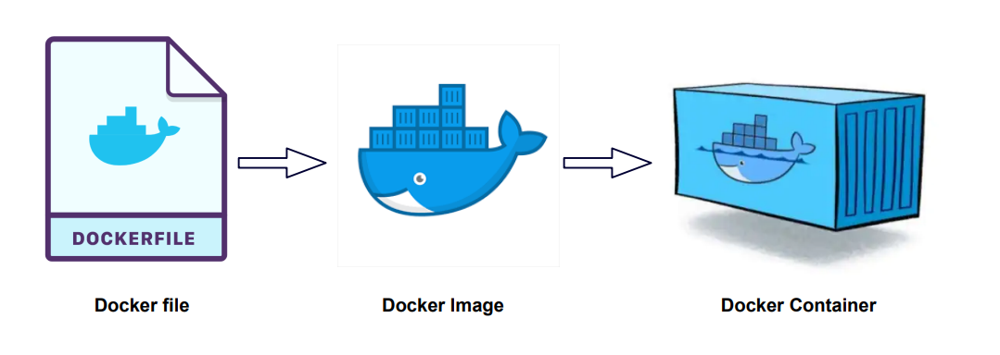

# SCCOTS Docker files



### Files

- **ubuntu** (Ubuntu 22.04)
- **develop** (ubuntu + Python, C++)
- **ros** (develop + ROS2 Humble)
- **spinnaker** (ros + spinnaker camera)    

These docker files are generated.
Edit the gebnerate.py file and run it to re-generate the files.

### Terminology

[[docker glossary](https://docs.docker.com/glossary/)]
[[docker terminology](https://docs.docker.com/contribute/style/terminology/)]

A docker container is a running environment 
with its own file system, but sharing the OS kernel
with its host operating system and other docker images running on it.
A docker container starts its life as a copy (instance) 
of a docker image.

A docker file is the specification (blueprint) for creating a docker image.

The docker server is the entity that runs docker containers.
A docker server on Linux can run only Linux containers.
A docker server on Windows can be configured to run either
Windows containers, or Linux containers (using WSL), but
not both at the same time. 
However, a container can run a VM, and that VM can run an OS that
is different from the host.
[[win vm in linux docker](https://medium.com/axon-technologies/installing-a-windows-virtual-machine-in-a-linux-docker-container-c78e4c3f9ba1)]
[[w10 enterprise](https://app.vagrantup.com/peru/boxes/windows-10-enterprise-x64-eval)]

### Installation

To install docker on Windows install the docker desktop.
Remember to restart it after a reboot.

To install docker on a fresh Ubuntu 22.04:

```
sudo apt-get update
sudo apt-get upgrade -y
sudo apt-get install -y curl
sudo apt-get install -y python-is-python3 python3-pip
sudo curl -sSL https://get.docker.com | sh
sudo docker version
```    
    
To enable docker use by a non-root user:

```
sudo usermod -aG docker <user-name>
```

### Build an image


To build a (local) image <image-name> from a sccots docker file <file-name>:

```
sudo docker build github.com/wovo/sccots#main -f dockers/<file-name> -t <image-name>
```

Building an image is essentially installing software on a fresh system,
so it can take considerable time.
When building, docker saves the result of each step
(layer in docker terms), so a re-try or extension will essentially start 
from the first failed or changed step.
The scotts container files are designed to take advantage of this effect.

### Run a container interactively

To run an image that has been built in a new container, 
and get a shell to work in:

```
sudo docker run --name <container-name> -it <image-name>
```

When you leave the shell of a container it is stopped.
A stopped container maintains it state.
You can re-attached to a stopped container:

```
sudo docker restart <container-name>
sudo docker attach <container-name>
```

A stopped container occupies space on the file system.
To delete a container:

```
sudo docker rm -f <container-name>
```

An error from a shell command while the current dirctory is
the root (/) terminates the shell, hence the sccots
images start the shell in /work.

### Using host resources

A container has its own file system.
You can provide access to elements of the host file system
when the container is created by adding
options to the docker run command.
For USB camera device, add 

```
--device "/dev/video0:/dev/video0"
```

For development, it is often convenient to have a work 
directory on the host system, on which better tooling
(editors etc.) is available.
To make the host directory ~/work available as /root/work, 
add
 
```
-v ~/work:/root/work 
```

To claim more memory than the default, use for instance
```
-m=8g
```    
