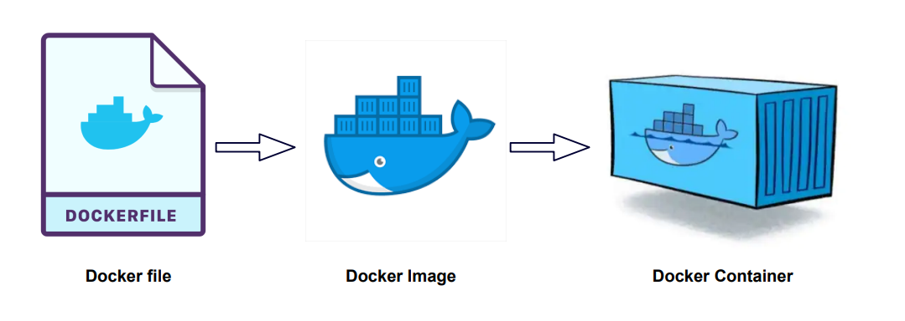

# SCCOTS
# Standard Cboost Components Of The Shelve

## Summary

Sccots is a set of re-usable components 
for intelligent industrial automation
using docker and ROS2.

Docker containers are used to isolate dependencies 
for hardware items like cameras
that require manufacturer specific tools 
(drivers, SDKs) to be installed.

ROS2 is used to provide communication between docker containers.
This enables redeployment of AI processing and user interfaces.

The current sccots baseline is:

- Ubuntu 22.04 LTS (Jammy Jellyfish)
- ROS2 Humble Hawksbill
- x64 (intel), aarch64 (Raspberry Pi 4)

## Docker



### Terminology

[docker glossary](https://docs.docker.com/glossary/)
[docker terminology](https://docs.docker.com/contribute/style/terminology/)

A docker container is a running environment 
with its own file system, but sharing the OS kernel
with its host operating system and other docker images running on it.
A docker container starts its life as a copy (instance) 
of a docker image.

A docker file is the specification (blueprint) for creating a docker image.

The docker server is the entity that runs docker containers.
A docker server on Linux can run only Linux containers.
A docker server on Windows can be configured to run either
windows containers, or Linux containers (using WSL), but
not both at the same time. 
However, a container can run a VM, and that VM can run an OS that
is different from the host.
[[win vm in linux docker](https://medium.com/axon-technologies/installing-a-windows-virtual-machine-in-a-linux-docker-container-c78e4c3f9ba1)]
[[w10 enterprise](https://app.vagrantup.com/peru/boxes/windows-10-enterprise-x64-eval)]

### Installation

To install docker on Windows install the docker desktop.
Remember to restart it after a reboot.

To install docker on a fresh Ubuntu 22.04:

```
sudo apt-get update
sudo apt-get upgrade -y
sudo apt-get install -y curl
sudo apt-get install -y python-is-python3 python3-pip
sudo curl -sSL https://get.docker.com | sh
sudo docker version
```    
    
To enable docker use by a non-root user:

```
sudo usermod -aG docker <user-name>
```

### Build an image

The sccots repository provides a number of docker files:

- **base** (Ubuntu 22.04, ROS2 Humble)
- **spinnaker** (base + spinnaker camera)


To build a (local) image image-name from a sccots docker file file-name:

```
sudo docker build github.com/wovo/sccots#main -f docker/<file-name> -t <image-name>
```

Building an image is essentially installing software on a fresh system,
so it can take considerable time.
When building, docker saves the result of each step
(layer in docker terms), so a re-try or extension will essentially start 
from the first failed or changed step.

### Run a container interactively

To run an image that has been built in a new container, 
and get a shell to work in:

```
sudo docker run --name <container-name> -it <image-name>
 -v ~/work:/root/work 
 --device "/dev/bus/usb/001/021:/dev/bus/usb/001/021"
 --device "/dev/video0:/dev/video0"
```

When you leave the shell of a container it is stopped.
A stopped container maintains it state.
You can re-attached to a stopped container:

```
sudo docker restart <container-name>
sudo docker attach <container-name>
```

A stopped container occupies space on the file system.
To delete a container:

```
sudo docker rm -f <container-name>
```

An error from a shell command while the current dirctory is
the root (/) terminates the shell, hence the sccots
images start the shell in /work.

### Using host resources

A container has its own file system.
You can provide access to elements of the host file system
when the container is created by adding
options to the docker run command.
For USB camera device, add 

```
--device "/dev/video0:/dev/video0"
```
For a working directory, add
 
```
-v ~/work:/root/work 
```

To claim more memory than the default, use for instance
```
-m=8g
```

## ROS2


### Terminology

ROS stands for Robot Operating System, 
but it is neither an OS nor specifically for robots.
ROS is middleware for communication between nodes, 
which can be on the same host, or on different hosts within the
same network (and with a VPN, on different networks).
[[tinc](https://www.tinc-vpn.org/)]
[[husarnet](https://husarnet.com/blog/ros2-docker)]

ROS2 is the more same version of ROS, 
with unified C++ / Python interfaces on top of same C implementation.
The old ROS had functionality in the C++ and Python layers, 
which could behave differently.

ROS versions have cute names.
[Humble](https://docs.ros.org/en/humble/)
(Humble Hawksbill) is as of 2023 the latest version of ROS2.

### Communication

ROS nodes within a ROS domain communicate via named topics.
A topic has a single publisher node, and zero or more subscriber nodes.
A node can publish and subscribe to multiple topics.

A topic can be a message, a service, or an action.

A message is a one-way publish-subscribe communication:
the publisher has no direct interaction with the subscribers.
By default, messages are queued for each subscriber (up to a specified limit), 
so each subscriber will in the end receive all messages.

A service is a request-response communication.
A user node issues a request.
The server node responds with a response.

An action is like a service, but while the action is 
being executed the user gets updates.

DDS (Data Distribution Service) is the defaulkt protocol used
by ROS2 to distribute topics to ros nodes.

ROS can record the value of topics (including responses and updates??)
over time in a bag file.
A bag file can be played back for simulation, demo, debugging, etc.    

Messages, service requests, service responses, action requests,
action updates, and action results are all defined by ros interfaces.
An interface defines the type (structure) of the transferred data.
ROS has many pre-defined interfaces, for isntance for 
[camera images](http://docs.ros.org/en/noetic/api/sensor_msgs/html/msg/Image.html).

By default, ros nodes in containers on the same host can communicate
with each other, but not with nodes containers on another host on the same network.
To enable communication over a network, add this to the docker run command
[[ref](https://answers.ros.org/question/358453/ros2-docker-multiple-hosts/)]:
```
--net=host --pid=host
```

package = collection of nodes, can have internal topics

parameter = configuration value for a node

node = participant in ROS communication

## USB camera

feh -Z -R 1 -Y
capture has a few seconds delay, but that seems to be the camera
@pi larger images are not received

## Spinnaker

## Terminology

topic
    distributed data
    ros2 topic 
        list
        info <topic>
        echo <topic> 
        pub <topic> <type> <data> --once --rate
        hz <topic>
    ros2 interface show <topic> 

## Raspberry Pi

- Raspberry Pi 4, 8 Gb memory, 32 Gb flash card
- Ubuntu 22.04, python 3.10.6
- download, flash, install takes ~ 1 hour (elapsed)
    
## Notes

- > 10 ms time domain
- installing ros-humble-desktop-full on Pi4 16 Gb gives errors
- include python3 in base
- migrate to https://git-lfs.com/
- ros nodes (in dockers) for:
    - gpio
    - camera
    - GUI
    - robot (arjun)
    - buisiness logic
    - sensors GPS, IMMU, Lidar /  profile-scanner, hyperspectral camera, 3D pointcloud 
    - actuators motor goto, updates, final
    - PLC 
    
ros node : a python or C++ object
ros application : a python or C++ application, 
docker container : can run a number of ros applications

https://www.ros.org/reps/rep-0145.html
https://github.com/ros-controls/ros2_control
https://control.ros.org/master/index.html
https://control.ros.org/master/doc/ros2_control/hardware_interface/doc/writing_new_hardware_interface.html
https://control.ros.org/master/doc/ros2_controllers/doc/controllers_index.html

sccots hardware interface
    service create <name>
        gpio <in,out,in_out,oc> <initial value> <specific>
            write <- 0 1 open
            read -> output 0, output 1, input 0, input 1
            publish?
        spi 
        i2c
        serial
            write -> string
            read <- string
            publish?
        keypad
        sensor        
        immu
    service list
    service delete    

